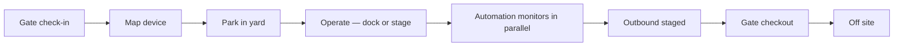
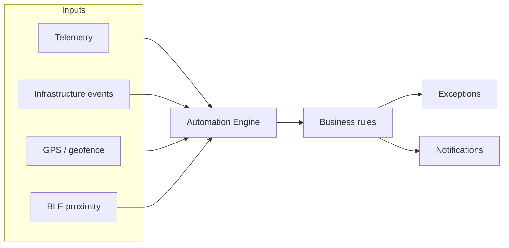

# Trailer visit — check-in to checkout (with automation)

On-site visit flow only: **gate check-in → device mapping → yard/dock operations → automated monitoring → gate checkout**.

Assumes the trailer is already registered and **Off site**. For the full lifecycle including registration, see [TRAILER_LIFECYCLE_FLOWCHART.md](./TRAILER_LIFECYCLE_FLOWCHART.md).

Related: [USER_FLOWS.md](./USER_FLOWS.md) · [USER_FLOWS_v1.md](./USER_FLOWS_v1.md)

---

## Main flowchart

```mermaid
%%{init: {'flowchart': {'curve': 'basis', 'padding': 18, 'nodeSpacing': 42, 'rankSpacing': 52}, 'theme': 'base', 'themeVariables': {'fontFamily': 'Georgia, Times New Roman, serif', 'fontSize': '13px', 'lineColor': '#4A154B', 'primaryTextColor': '#1B1B1B'}}}%%
flowchart TD
  startNode([START]) --> openVisit[Open Visit — trailer Off site arrives at gate]
  openVisit --> checkIn[Gate check-in — inbound lane]
  checkIn --> assignDevice[Select and assign Trailer Device — required]
  assignDevice --> validateDevice[Validate battery, connectivity, firmware and health score]
  validateDevice --> validationPassed{Device health validation passed?}
  validationPassed -->|No| deviceRemediation[Replace or remediate device]
  deviceRemediation --> assignDevice
  validationPassed -->|Yes| mapDevice[Map Device to Trailer and Visit]
  mapDevice --> loadCapabilities[Load device capabilities]
  loadCapabilities --> capabilitySet[RFID · GPS · BLE · Temperature · Fuel · LTE/5G]
  capabilitySet --> activateFeatures[Activate supported features only]
  activateFeatures --> telemetry[Start telemetry]
  activateFeatures --> gateEvent[Automatically record gate-in event]

  gateEvent --> slotChoice{Parking slot selected at check-in?}
  slotChoice -->|Yes| assignSlot[Assign selected slot]
  slotChoice -->|No| bleAvailable{BLE capability active?}
  bleAvailable -->|Yes| slotProximity[BLE determines slot proximity]
  slotProximity --> slotRecommend[Automatically recommend available slot]
  slotRecommend --> slotConfirm{Operator confirms recommendation?}
  slotConfirm -->|Yes| assignSlot
  slotConfirm -->|No| manualSlot[Select another available slot]
  bleAvailable -->|No| manualSlot
  manualSlot --> assignSlot
  assignSlot --> inYard[Status: In yard]

  telemetry --> tempMonitor[Temperature monitoring — if supported]
  telemetry --> fuelMonitor[Fuel monitoring — if supported]
  telemetry --> dwellMonitor[Visit dwell monitoring]
  telemetry --> healthMonitor[Device and connectivity health]
  telemetry --> gpsMonitor[GPS monitoring — if supported]
  telemetry --> bleMonitor[BLE monitoring — if supported]
  gpsMonitor --> currentPosition[GPS determines current yard position]
  currentPosition --> movementEvent[Trailer movement event]
  gpsMonitor --> geofenceEvent[GPS geofence entry or exit]
  bleMonitor --> slotProximity

  rfidReader[RFID reader] --> rfidEvent[Gate entry, gate exit and RFID read]
  bleAnchor[BLE anchor] --> slotRecommend
  dockSensor[Dock sensor] --> dockInfraEvent[Dock occupancy or dock release]
  geofenceEvent --> infraEvents[Infrastructure Events]
  movementEvent --> infraEvents
  rfidEvent --> infraEvents
  slotRecommend --> infraEvents
  dockInfraEvent --> infraEvents
  infraHealth[Infrastructure health] --> infraStatus[Infrastructure offline or communication restored]
  infraStatus --> infraEvents
  telemetry --> edgeGateway[Edge gateway telemetry processing]
  edgeGateway --> automationEngine[Automation Engine]
  infraEvents --> automationEngine

  tempMonitor --> automationEngine
  fuelMonitor --> automationEngine
  dwellMonitor --> automationEngine
  healthMonitor --> automationEngine
  gpsMonitor --> automationEngine
  bleMonitor --> automationEngine
  automationEngine --> businessRules[Evaluate temperature, fuel, dwell, device health, GPS, BLE, geofence and infrastructure rules]
  businessRules --> workflowUpdate[Update Visit operational workflow]
  businessRules --> issueDecision{Exception detected?}
  issueDecision -->|No| telemetry
  issueDecision -->|Yes| exceptionQueue[Automatically create prioritized exception]
  exceptionQueue --> notify[Notification with severity, SLA and playbook]
  notify --> assignOwner[Assign owner]
  assignOwner --> inspect[Inspection]
  inspect --> holdDecision{Safety hold required?}
  holdDecision -->|Yes| applyHold[Overlay: apply QA Hold or Yard Hold]
  applyHold --> resolve[Resolution]
  holdDecision -->|No| resolve
  resolve --> holdApplied{Hold overlay active?}
  holdApplied -->|Yes| clearHold[Clear hold overlay]
  holdApplied -->|No| resumeOperations[Resume operations]
  clearHold --> resumeOperations

  inYard --> dockDecision{Dock required?}
  resumeOperations --> dockDecision
  dockDecision -->|Yes| readyDock[Status: Ready to dock]
  readyDock --> blocked{Active hold or unresolved exception?}
  blocked -->|Yes| inspect
  blocked -->|No| assignDoor[Assign dock]
  assignDoor --> atDock[Status: At dock]
  atDock --> dockOccupancy[Dock occupancy event]
  dockOccupancy --> dockInfraEvent
  dockOccupancy --> dockWork[Loading or unloading]
  dockWork --> qaVerification[QA verification]
  qaVerification --> dockCompleted[Dock work completed]
  dockCompleted --> unlock[Unlock dock]
  unlock --> dockRelease[Dock release event]
  dockRelease --> dockInfraEvent
  dockRelease --> staged[Status: Outbound staged]

  dockDecision -->|No| stageDirect[Stage for departure]
  stageDirect --> staged
  staged --> recoverDevice[Recover device at gate]
  recoverDevice --> deviceInspection[Device inspection]
  deviceInspection --> recoveryDisposition{Device disposition}
  recoveryDisposition -->|Healthy| charging[Charging]
  recoveryDisposition -->|Issue found| maintenance[Maintenance]
  charging --> unmap[Unmap device from Visit — Available]
  maintenance --> unmap
  unmap --> exitValidation[Validate QA complete, holds cleared, dock complete if required, device recovered and exceptions resolved]
  exitValidation --> exitReady{Gate exit validation passed?}
  exitReady -->|No| resolveBlockers[Resolve departure blockers]
  resolveBlockers --> exitValidation
  exitReady -->|Yes| checkOut[Gate exit — outbound lane]
  checkOut --> gateOut[Automatically record gate-out and GPS geofence exit]
  gateOut --> infraEvents
  gateOut --> completeVisit[Complete Visit]
  completeVisit --> departed[Status: Off site]
  departed --> finishNode([END])

  classDef startPill fill:#B8E6B8,stroke:#2E7D32,stroke-width:2px,color:#1B1B1B,font-weight:bold
  classDef endPill fill:#D4B8F0,stroke:#7B1FA2,stroke-width:2px,color:#1B1B1B,font-weight:bold
  classDef action fill:#C8E6C9,stroke:#43A047,stroke-width:1.5px,color:#1B1B1B
  classDef decision fill:#E8B4F0,stroke:#9C27B0,stroke-width:1.5px,color:#1B1B1B
  classDef alert fill:#4A154B,stroke:#2D0A2E,stroke-width:2px,color:#FFFFFF

  class startNode startPill
  class finishNode endPill

  class openVisit,checkIn,assignDevice,mapDevice,validateDevice,loadCapabilities,capabilitySet,activateFeatures,telemetry,gateEvent,assignSlot,slotProximity,slotRecommend,manualSlot,inYard,tempMonitor,fuelMonitor,dwellMonitor,healthMonitor,gpsMonitor,bleMonitor,currentPosition,movementEvent,geofenceEvent,rfidReader,rfidEvent,bleAnchor,dockSensor,dockInfraEvent,infraEvents,infraHealth,infraStatus,edgeGateway,automationEngine,businessRules,workflowUpdate,notify,assignOwner,inspect,resolve,clearHold,resumeOperations,readyDock,assignDoor,atDock,dockOccupancy,dockWork,qaVerification,dockCompleted,unlock,dockRelease,staged,stageDirect,recoverDevice,deviceInspection,charging,maintenance,unmap,exitValidation,checkOut,gateOut,completeVisit,departed action

  class validationPassed,slotChoice,bleAvailable,slotConfirm,issueDecision,holdDecision,holdApplied,dockDecision,blocked,recoveryDisposition,exitReady decision

  class deviceRemediation,exceptionQueue,applyHold,resolveBlockers alert
```



### Design legend

| Style | Shape | Color | Used for |
|-------|-------|-------|----------|
| **Start / End** | Pill | Mint green / Lavender | Visit start and end |
| **Action** | Rectangle | Light green | Operator and system steps |
| **Decision** | Diamond | Light purple | Yes / No branches |
| **Alert** | Rectangle | Dark purple | Remediation, exceptions, holds, blockers |

---

## Visit at a glance



---

## Visit phases (check-in → checkout)

| # | Phase | Status | Who / where |
|---|-------|--------|-------------|
| 1 | **Open visit** | Off site → Gate arrived | Gate Clerk — **Gates** |
| 2 | **Check in** | Gate arrived | Inbound lane, seal/temp capture |
| 3 | **Assign & map device** | — | Select device → validate → map to Visit |
| 4 | **Park** | In yard | Manual slot or BLE recommendation + confirm |
| 5 | **Operate** | In yard → At dock | **Yards** / **Docks** (optional dock path) |
| 6 | **Monitor** | (parallel) | Automation Engine — **Cold Chain**, **Exceptions** |
| 7 | **Stage exit** | Outbound staged | **Docks** / **Yards** |
| 8 | **Recover device** | Outbound staged | Inspect → charge or maintain |
| 9 | **Validate & exit** | Off site | Departure checks → gate exit → complete Visit |

---

## Automation during the visit

### Automation boundary

| Type | What runs automatically |
|------|-------------------------|
| **Operator required** | Check-in, device selection, slot confirm, dock assign, exception inspect/resolve, gate exit |
| **Assisted** | BLE slot proximity and recommendation — operator confirms before assign |
| **Fully automatic** | Gate-in/out events, geofence, capability-based telemetry, dwell, Automation Engine rules, exceptions, notifications, infrastructure events |

### Automation Engine inputs



### Capability-driven monitoring

Only activated when the mapped device supports the capability:

| Capability | Monitoring | Automation output |
|------------|------------|-------------------|
| **Temperature** | Actual vs setpoint, reefer alarm | Warming / excursion exception |
| **Fuel** | Reefer fuel % | Low fuel below 25% |
| **GPS** | Yard position, movement | Geofence entry/exit — never assigns slots |
| **BLE** | Slot proximity | Slot recommendation only |
| **LTE/5G** | Connectivity | Device offline exception |
| **RFID** | (via infrastructure) | Gate entry/exit reads |

### Infrastructure-generated events

| Source | Event | Feeds |
|--------|-------|-------|
| RFID reader | Gate entry, gate exit, RFID read | Visit gate workflow |
| BLE anchor | Slot recommendation | Parking assist |
| Dock sensor | Occupancy, release | Dock workflow |
| GPS geofence | Yard entry, yard exit | Geofence log, recovery prompts |
| Edge gateway | Telemetry processing | Automation Engine |
| Infrastructure health | Offline, communication restored | Operational alerts |

### Exception workflow (automatic detection)

```
Exception detected → Notification → Assign owner → Inspection → Resolution → Resume operations
```

QA Hold and Yard Hold are **overlays** — they pause work but are not lifecycle states.

| Signal | Trigger | Playbook |
|--------|---------|----------|
| Temperature | Warming, excursion, alarm, stale | Temperature alert |
| Fuel | Below 25% | Low fuel alert |
| Dwell | 16+ hours on site | Excess dwell |
| Device | GPS/BLE/LTE offline | Connectivity playbooks |
| Geofence | Leave yard before checkout with device mapped | Device recovery at **Gates** |

### Dock path vs skip-dock

| dockRequired | Path |
|--------------|------|
| **true** | Ready to dock → Assign dock → Load/unload → QA verify → Complete → Unlock → Outbound staged |
| **false** | In yard → Stage for departure → Outbound staged |

### Gate exit validation (before checkout)

All must pass:

- QA completed (if dock path)
- Holds cleared
- Dock completed (if dock required)
- Device recovered and unmapped
- Exceptions resolved

Then: **Gate exit** → record gate-out → complete Visit → **Off site**.

### Device recovery at checkout

```
Recover device → Device inspection → Charging or Maintenance → Unmap → Available
```

---

## Technical reference (mock app)

| Step | Where | API / module |
|------|-------|----------------|
| Check-in | `/gate`, `/trailers` | `checkInTrailer` |
| Device map | Gate check-in modal | `assignDeviceToTrailer` |
| Slot assign | `/yards` | `assignParkingSlot`, `applyBleProximitySlot` |
| Telemetry | Background (45s) | `runTelemetryTick` |
| Exceptions | Background | `ExceptionsContext.derive` |
| Geofence | `/yards`, `/gate` | `recordEvent`, `pendingRecovery` |
| Dock | `/dock` | `assignToDock`, `unlockDoor` |
| Checkout | `/gate` | `gateExitTrailer`, `unassignDevice`, `setDeviceLifecycle('charging')` |
