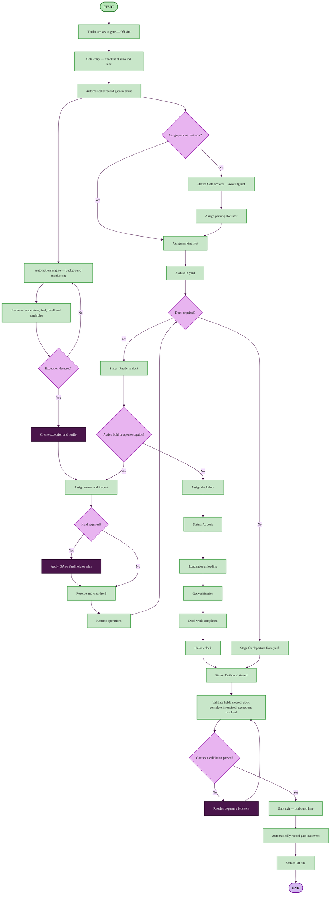
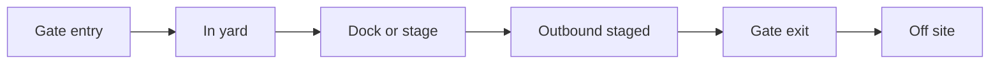

# Trailer gate flow — entry to exit

Simplified visit flow: **gate entry → yard/dock operations → gate exit**. No device assignment or mapping steps.

Assumes the trailer is registered and **Off site**. For device mapping and full automation detail, see [TRAILER_CHECKIN_TO_CHECKOUT.md](./TRAILER_CHECKIN_TO_CHECKOUT.md).

Related: [USER_FLOWS.md](./USER_FLOWS.md) · [TRAILER_LIFECYCLE_FLOWCHART.md](./TRAILER_LIFECYCLE_FLOWCHART.md)

---

## Main flowchart

### Design legend

| Style | Shape | Color | Used for |
|-------|-------|-------|----------|
| **Start / End** | Pill | Mint green / Lavender | Gate entry and exit |
| **Action** | Rectangle | Light green | Process steps |
| **Decision** | Diamond | Light purple | Yes / No branches |
| **Alert** | Rectangle | Dark purple | Exceptions, holds, blockers |

---

## At a glance

---

## Gate flow summary

| Step | Status | Where |
|------|--------|-------|
| 1. **Gate entry** | Gate arrived | **Gates** — inbound lane, seal/temp |
| 2. **Park** | In yard | **Gates** / **Yards** — assign slot now or later |
| 3. **Operate** | In yard → At dock | **Yards** / **Docks** (if dock required) |
| 4. **Stage** | Outbound staged | **Docks** / **Yards** |
| 5. **Gate exit** | Off site | **Gates** — outbound lane |

---

## Automation (gate-focused)

| Type | What happens |
|------|----------------|
| **Operator** | Check in, assign slot, dock work, resolve exceptions, gate exit |
| **Assisted** | System may recommend a parking slot — operator confirms |
| **Automatic** | Gate-in/out events, background monitoring, exception alerts, dwell/temp/fuel rules, exit validation checks |

### Background monitoring (parallel)

While on site, the Automation Engine evaluates:

- Temperature and cold-chain rules  
- Low fuel  
- Long dwell  
- Open exceptions  

When triggered: **notify → assign owner → inspect → resolve** (hold overlay if needed).

### Dock path

| dockRequired | Flow |
|--------------|------|
| **Yes** | Ready to dock → Assign door → Load/unload → QA → Unlock → Outbound staged |
| **No** | In yard → Stage for departure → Outbound staged |

### Gate exit validation

Before outbound lane exit:

- Holds cleared  
- Dock complete (if required)  
- Exceptions resolved  

Then: **gate exit** → auto gate-out event → **Off site**.

---

## Where in the app

| Action | Screen |
|--------|--------|
| Gate entry | **Gates** → Check in trailer |
| Assign slot | **Gates** / **Yards** |
| Dock work | **Docks** |
| Exceptions | **Exceptions** |
| Gate exit | **Gates** → Gate exit |
