# Trailer lifecycle — main flowchart (lifecycle and automation)

End-to-end visit flow for a trailer in Boar's Head Smart Yard: **register → check in → map device → yard/dock operations → automated monitoring → gate checkout**.

Related docs: [USER_FLOWS.md](./USER_FLOWS.md) (operator guide) · [USER_FLOWS_v1.md](./USER_FLOWS_v1.md) · [TRAILER_CHECKIN_TO_CHECKOUT.md](./TRAILER_CHECKIN_TO_CHECKOUT.md) (visit only: check-in → checkout)

---

## Main flowchart

```mermaid
%%{init: {'flowchart': {'curve': 'basis', 'padding': 18, 'nodeSpacing': 42, 'rankSpacing': 52}, 'theme': 'base', 'themeVariables': {'fontFamily': 'Georgia, Times New Roman, serif', 'fontSize': '13px', 'lineColor': '#4A154B', 'primaryTextColor': '#1B1B1B'}}}%%
flowchart TD
  startNode([START]) --> register[Register trailer]
  register --> offSite[Status: Off site]
  offSite --> createVisit[Create Visit]
  createVisit --> visitRecord[Visit owns gate check-in, device, parking, dock, exceptions and departure]
  visitRecord --> arrival[Trailer arrives at gate]
  arrival --> checkIn[Gate check-in]
  checkIn --> assignDevice[Select and assign Trailer Device — required]
  assignDevice --> validateDevice[Validate battery, connectivity, firmware and health score]
  validateDevice --> validationPassed{Device health validation passed?}
  validationPassed -->|No| deviceRemediation[Replace or remediate device]
  deviceRemediation --> assignDevice
  validationPassed -->|Yes| mapDevice[Map Device to Trailer and Visit]
  mapDevice --> loadCapabilities[Load device capabilities]
  loadCapabilities --> capabilitySet[RFID · GPS · BLE · Temperature · Fuel · LTE/5G]
  capabilitySet --> activateFeatures[Activate supported features only]
  activateFeatures --> telemetry[Start telemetry]
  activateFeatures --> gateEvent[Automatically record gate-in event]
  gateEvent --> slotChoice{Parking slot selected at check-in?}

  slotChoice -->|Yes| assignSlot[Assign selected slot]
  slotChoice -->|No| bleAvailable{BLE capability active?}
  bleAvailable -->|Yes| slotProximity[BLE determines slot proximity]
  slotProximity --> slotRecommend[Automatically recommend available slot]
  slotRecommend --> slotConfirm{Operator confirms recommendation?}
  slotConfirm -->|Yes| assignSlot
  slotConfirm -->|No| manualSlot[Select another available slot]
  bleAvailable -->|No| manualSlot
  manualSlot --> assignSlot
  assignSlot --> inYard[Status: In yard]

  telemetry --> tempMonitor[Temperature monitoring — if supported]
  telemetry --> fuelMonitor[Fuel monitoring — if supported]
  telemetry --> dwellMonitor[Visit dwell monitoring]
  telemetry --> healthMonitor[Device and connectivity health]
  telemetry --> gpsMonitor[GPS monitoring — if supported]
  telemetry --> bleMonitor[BLE monitoring — if supported]
  gpsMonitor --> currentPosition[GPS determines current yard position]
  currentPosition --> movementEvent[Trailer movement event]
  gpsMonitor --> geofenceEvent[GPS geofence entry or exit]
  bleMonitor --> slotProximity

  rfidReader[RFID reader] --> rfidEvent[Gate entry, gate exit and RFID read]
  bleAnchor[BLE anchor] --> slotRecommend
  dockSensor[Dock sensor] --> dockInfraEvent[Dock occupancy or dock release]
  geofenceEvent --> infraEvents[Infrastructure Events]
  movementEvent --> infraEvents
  rfidEvent --> infraEvents
  slotRecommend --> infraEvents
  dockInfraEvent --> infraEvents
  infraHealth[Infrastructure health] --> infraStatus[Infrastructure offline or communication restored]
  infraStatus --> infraEvents
  telemetry --> edgeGateway[Edge gateway telemetry processing]
  edgeGateway --> automationEngine[Automation Engine]
  infraEvents --> automationEngine

  tempMonitor --> automationEngine
  fuelMonitor --> automationEngine
  dwellMonitor --> automationEngine
  healthMonitor --> automationEngine
  gpsMonitor --> automationEngine
  bleMonitor --> automationEngine
  automationEngine --> businessRules[Evaluate temperature, fuel, dwell, device health, GPS, BLE, geofence and infrastructure rules]
  businessRules --> workflowUpdate[Update Visit operational workflow]
  businessRules --> issueDecision{Exception detected?}
  issueDecision -->|No| telemetry
  issueDecision -->|Yes| exceptionQueue[Automatically create prioritized exception]
  exceptionQueue --> notify[Notification with severity, SLA and playbook]
  notify --> assignOwner[Assign owner]
  assignOwner --> inspect[Inspection]
  inspect --> holdDecision{Safety hold required?}
  holdDecision -->|Yes| applyHold[Overlay: apply QA Hold or Yard Hold]
  applyHold --> resolve[Resolution]
  holdDecision -->|No| resolve
  resolve --> holdApplied{Hold overlay active?}
  holdApplied -->|Yes| clearHold[Clear hold overlay]
  holdApplied -->|No| resumeOperations[Resume operations]
  clearHold --> resumeOperations

  inYard --> dockDecision{Dock required?}
  resumeOperations --> dockDecision
  dockDecision -->|Yes| readyDock[Status: Ready to dock]
  readyDock --> blocked{Active hold or unresolved exception?}
  blocked -->|Yes| inspect
  blocked -->|No| assignDoor[Assign dock]
  assignDoor --> atDock[Status: At dock]
  atDock --> dockOccupancy[Dock occupancy event]
  dockOccupancy --> dockInfraEvent
  dockOccupancy --> dockWork[Loading or unloading]
  dockWork --> qaVerification[QA verification]
  qaVerification --> dockCompleted[Dock work completed]
  dockCompleted --> unlock[Unlock dock]
  unlock --> dockRelease[Dock release event]
  dockRelease --> dockInfraEvent
  dockRelease --> staged[Status: Outbound staged]

  dockDecision -->|No| stageDirect[Stage for departure]
  stageDirect --> staged
  staged --> recoverDevice[Recover device at gate]
  recoverDevice --> deviceInspection[Device inspection]
  deviceInspection --> recoveryDisposition{Device disposition}
  recoveryDisposition -->|Healthy| charging[Charging]
  recoveryDisposition -->|Issue found| maintenance[Maintenance]
  charging --> unmap[Unmap device from Visit — Available]
  maintenance --> unmap
  unmap --> exitValidation[Validate QA complete, holds cleared, dock complete if required, device recovered and exceptions resolved]
  exitValidation --> exitReady{Gate exit validation passed?}
  exitReady -->|No| resolveBlockers[Resolve departure blockers]
  resolveBlockers --> exitValidation
  exitReady -->|Yes| checkOut[Gate exit]
  checkOut --> gateOut[Automatically record gate-out and GPS geofence exit]
  gateOut --> infraEvents
  gateOut --> completeVisit[Complete Visit]
  completeVisit --> departed[Status: Off site]
  departed --> finishNode([END])

  classDef startPill fill:#B8E6B8,stroke:#2E7D32,stroke-width:2px,color:#1B1B1B,font-weight:bold
  classDef endPill fill:#D4B8F0,stroke:#7B1FA2,stroke-width:2px,color:#1B1B1B,font-weight:bold
  classDef action fill:#C8E6C9,stroke:#43A047,stroke-width:1.5px,color:#1B1B1B
  classDef decision fill:#E8B4F0,stroke:#9C27B0,stroke-width:1.5px,color:#1B1B1B
  classDef alert fill:#4A154B,stroke:#2D0A2E,stroke-width:2px,color:#FFFFFF

  class startNode startPill
  class finishNode endPill

  class register,offSite,createVisit,visitRecord,arrival,checkIn,assignDevice,mapDevice,validateDevice,loadCapabilities,capabilitySet,activateFeatures,telemetry,gateEvent,assignSlot,slotProximity,slotRecommend,manualSlot,inYard,tempMonitor,fuelMonitor,dwellMonitor,healthMonitor,gpsMonitor,bleMonitor,currentPosition,movementEvent,geofenceEvent,rfidReader,rfidEvent,bleAnchor,dockSensor,dockInfraEvent,infraEvents,infraHealth,infraStatus,edgeGateway,automationEngine,businessRules,workflowUpdate,notify,assignOwner,inspect,resolve,clearHold,resumeOperations,readyDock,assignDoor,atDock,dockOccupancy,dockWork,qaVerification,dockCompleted,unlock,dockRelease,staged,stageDirect,recoverDevice,deviceInspection,charging,maintenance,unmap,exitValidation,checkOut,gateOut,completeVisit,departed action

  class validationPassed,slotChoice,bleAvailable,slotConfirm,issueDecision,holdDecision,holdApplied,dockDecision,blocked,recoveryDisposition,exitReady decision

  class deviceRemediation,exceptionQueue,applyHold,resolveBlockers alert
```

### Design legend

| Style | Shape | Color | Used for |
|-------|-------|-------|----------|
| **Start / End** | Pill | Mint green / Lavender | START and END |
| **Action** | Rectangle | Light green | Process steps and system actions |
| **Decision** | Diamond | Light purple | Yes / No branch points |
| **Alert** | Rectangle | Dark purple (white text) | Remediation, exceptions, holds, blockers |

Flow and logic are unchanged — only visual styling matches the reference flowchart design.

---

## Automation boundary

| Type | What happens |
|------|----------------|
| **Operator required** | Register trailer, gate check-in, select device, map it to the Trailer and Visit, confirm or choose parking slot, dock assignment, exception ownership and inspection, gate checkout, device recovery |
| **Assisted automation** | BLE determines slot proximity and recommends a parking slot; the operator confirms before assignment |
| **Fully automatic** | Visit creation, device capability activation, supported telemetry, infrastructure events, dwell calculation, Automation Engine rules, exception creation, notifications, playbooks and SLA |

**Slot assignment is assisted, not fully autonomous.** GPS reports yard position, geofence activity, and movement. BLE alone determines slot proximity and recommends a slot. The operator confirms before assignment.

---

## Lifecycle phases

| Phase | Status | Who / where |
|-------|--------|-------------|
| 1. Register | Off site | Yard Ops / Admin — **Trailers** |
| 2. Create Visit | Off site | System — owns the complete operational visit |
| 3. Check in | Gate arrived or In yard | Gate Clerk — **Gates** |
| 4. Validate and map device | — | System validates health, then maps the device to the Trailer and Visit before telemetry |
| 5. Park | In yard | Gate or Yard — **Gates** / **Yards** |
| 6. Operate | In yard → Ready to dock → At dock | Yard Ops — **Yards** / **Docks** |
| 7. Monitor | (parallel) | Automation Engine — **Cold Chain**, **Exceptions**, **Dashboard** |
| 8. Stage exit | Outbound staged | Yard Ops — **Docks** / **Yards** |
| 9. Recover device | Outbound staged | Gate Clerk — inspect, charge or maintain, return to available |
| 10. Validate and exit | Off site | System validation, then Gate Clerk — **Gates** |

---

## Automated monitoring rules

After device validation succeeds, only services supported by the device capability set are activated. Telemetry and infrastructure events feed the Automation Engine:

| Signal | Trigger | Result |
|--------|---------|--------|
| **Temperature** | Warming, excursion, reefer alarm, or stale telemetry | Exception + notification; may require QA hold |
| **Fuel** | Below 25% | Low-fuel exception + yard ops playbook |
| **Dwell** | 16+ hours on site | Long-dwell exception |
| **Device health** | GPS, BLE, or LTE degraded/offline | Connectivity exception |
| **Geofence** | Leaves yard perimeter before gate exit with device still mapped | Device recovery alert at **Gates** |
| **Infrastructure** | Asset offline or communication restored | Operational event and workflow update |
| **Dock sensor** | Occupancy or release | Update dock workflow |
| **RFID reader** | Gate entry, gate exit, or RFID read | Update Visit gate workflow |

Exceptions appear in **Exceptions** with severity, SLA, and a suggested playbook. Operators assign an owner, inspect, resolve, and clear any hold before resuming dock or yard moves.

---

## Technical implementation (mock app)

| Step | Route / module | Key API |
|------|----------------|---------|
| Register | `/trailers` | `addTrailer` |
| Visit | conceptual lifecycle aggregate | Owns gate, device, parking, dock, exceptions and departure |
| Check-in + device selection | `/gate`, `/trailers` | `checkInTrailer`, select Trailer Device |
| Device validation + mapping | Smart device context | Validate health, `assignDeviceToTrailer`, map to Visit, load capabilities |
| Slot recommend | `/yards` | BLE proximity → `assignParkingSlot`, `applyBleProximitySlot` |
| Telemetry | background | `runTelemetryTick` (45s) |
| Automation | background | Evaluate telemetry, device health, geofence and infrastructure events |
| Exceptions | background | `ExceptionsContext.derive`, notification, owner, inspection, resolution |
| Infrastructure | `/infrastructure` | RFID, BLE, dock, geofence and gateway events |
| Checkout | `/gate` | Validate departure, recover device, `gateExitTrailer`, complete Visit |
