# Boar’s Head Smart Yard — User Flows & Automation

A guide to how people use Smart Yard day to day: who does what, how a trailer moves through the site, and what the system handles automatically.

---

## 1. What Smart Yard is

Smart Yard is the operations hub for Boar’s Head’s distribution center yard. It connects **Gate**, **Yards**, **Docks**, and **Cold Chain** in one place so teams can:

- See what is on site right now
- Check trailers in and out at the gate
- Assign parking slots and dock doors
- Monitor temperature and quality
- Respond to exceptions before product is at risk

Users work mainly on the **desktop** app. Field staff can use the **mobile** view for walks, scans, and inspections.

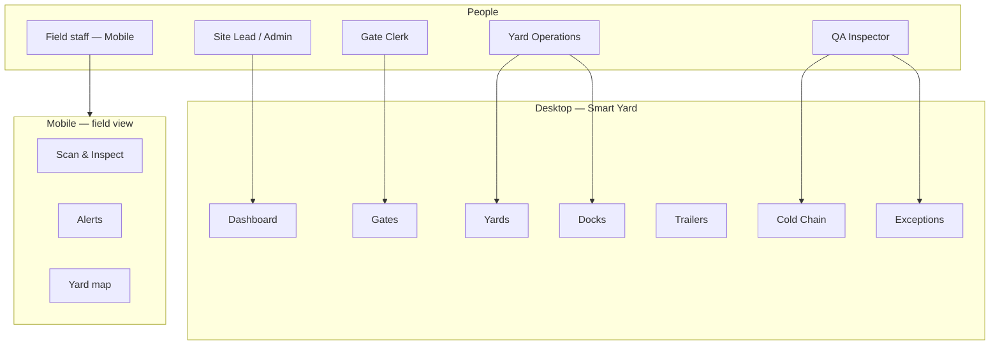

---

## 2. Who uses Smart Yard

| Role | Typical user | What they do |
|------|--------------|--------------|
| **Gate Clerk** | Casey Brooks | Check trailers in and out, verify seals, manage gate lanes |
| **Yard Operations** | Jordan Hale | Parking slots, trailer movements, dock queue, staging outbound |
| **QA Inspector** | Sam Okonkwo | Cold-chain compliance, holds, exception review and resolution |
| **Site Lead** | Morgan Chen | Oversight, analytics, escalation across gate and yard |
| **Platform Admin** | Alex Rivera | User accounts, full access to all areas |
| **Viewer** | Riley Nguyen | Read-only visibility for stakeholders |

Each person sees only the areas relevant to their job. For example, a Gate Clerk sees Gates and Trailers; a QA Inspector sees Cold Chain and Exceptions.

---

## 3. Getting started

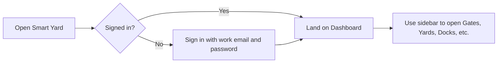

**Sign in**
1. Open Smart Yard in the browser.
2. Enter your work email and password.
3. You arrive at the **Dashboard** with a live picture of the yard.

**Sign out**
- Use **Logout** in the sidebar when your shift ends.

**Switch to mobile**
- Click **Mobile** in the top header to open the field view in a new tab (useful for yard walks with a phone or tablet).

---

## 4. Trailer lifecycle — register to checkout

End-to-end flow from fleet register through device mapping, yard operations, and gate checkout — shown as a **layered architecture** (how physical assets, platform services, and operator apps connect).

### Main flowchart — lifecycle and automation

See **[TRAILER_LIFECYCLE_FLOWCHART.md](./TRAILER_LIFECYCLE_FLOWCHART.md)** for the full end-to-end diagram (register through checkout).

For **check-in to checkout only** (on-site visit + automation), see **[TRAILER_CHECKIN_TO_CHECKOUT.md](./TRAILER_CHECKIN_TO_CHECKOUT.md)**.

For **gate entry to exit only** (no device details), see **[TRAILER_GATE_ENTRY_EXIT.md](./TRAILER_GATE_ENTRY_EXIT.md)**.

**Automation boundary:** Smart Yard recommends a slot automatically using GPS and BLE, but an operator must confirm it before assignment. Temperature, fuel, dwell, device health, exceptions, notifications, and gate/geofence events update automatically.

### Architecture view

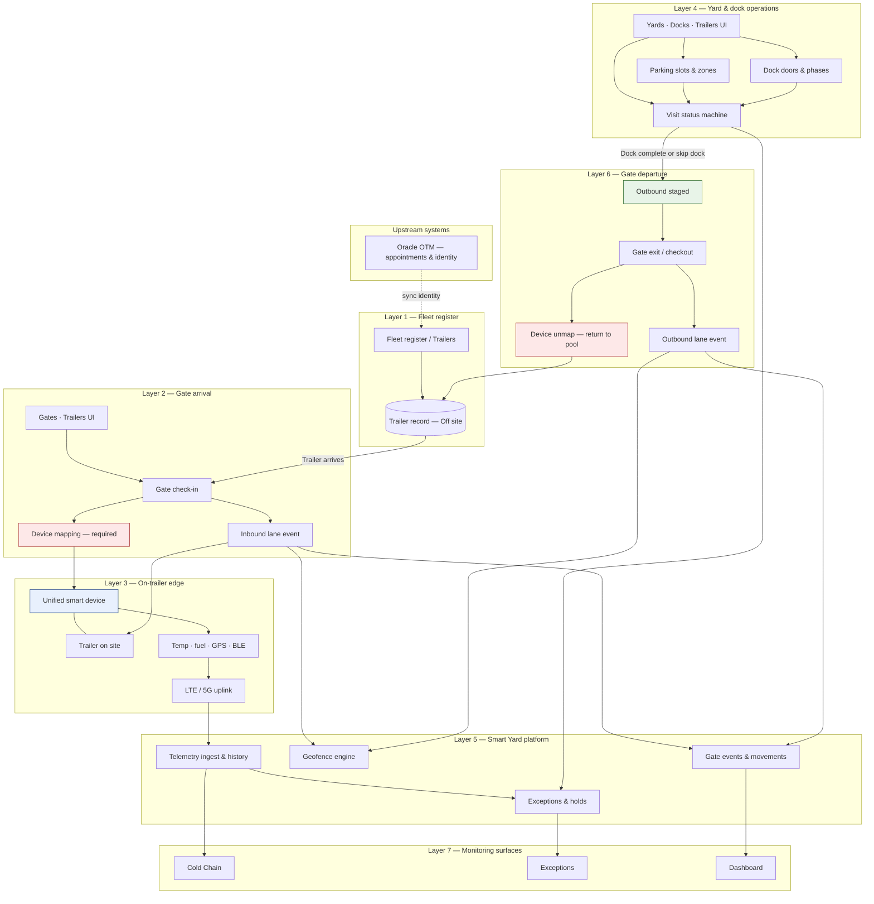

### Lifecycle phases across layers

| Phase | Layer | Primary components | Outcome |
|-------|-------|-------------------|---------|
| **1. Register** | Fleet register | Trailers, OTM identity | Trailer record — **Off site** |
| **2. Check in** | Gate arrival | Gates UI, inbound lane | Trailer on site; gate event logged |
| **3. Map device** | Gate + edge | Device mapping, unified device | Smart unit linked; telemetry live |
| **4. Park & operate** | Yard & dock | Yards, Docks, status machine | **In yard** → dock path or direct stage |
| **5. Monitor** | Platform | Telemetry, geofence, exceptions | Cold chain + holds while on site |
| **6. Stage exit** | Yard & dock | Status → Outbound staged | Cleared to leave |
| **7. Checkout** | Gate departure | Gate exit, device unmap | **Off site**; device back in pool |

### Data flow summary

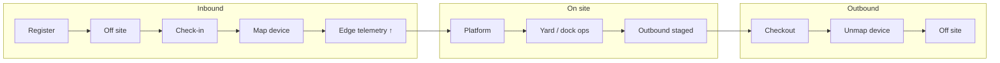

### Operator journey (simplified)

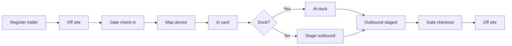

### Step-by-step

| # | Phase | Who | Where | What happens |
|---|-------|-----|-------|--------------|
| 1 | **Register** | Yard Ops / Admin | **Trailers** | New trailer added to fleet register; status is **Off site** |
| 2 | **Arrive** | Gate Clerk | **Gates** | Trailer checks in at inbound lane |
| 3 | **Map device** | Gate Clerk | **Gates** (check-in) | Smart trailer device assigned and linked to trailer — **required before check-in completes** |
| 4 | **Park** | Gate or Yard | **Gates** / **Yards** | Parking slot assigned → **In yard**; or trailer waits at gate |
| 5 | **Operate** | Yard Ops | **Yards** / **Docks** | Move through dock queue OR stage for direct departure |
| 6 | **Hold** (if needed) | QA / Yard | **Trailers** / **Exceptions** | QA or Yard hold pauses work until cleared |
| 7 | **Stage exit** | Yard Ops | **Docks** / **Yards** | Trailer becomes **Outbound staged** |
| 8 | **Checkout** | Gate Clerk | **Gates** | Gate exit on outbound lane |
| 9 | **Close visit** | Gate Clerk | **Gates** | Device unmapped; trailer returns to **Off site** |

### Status journey

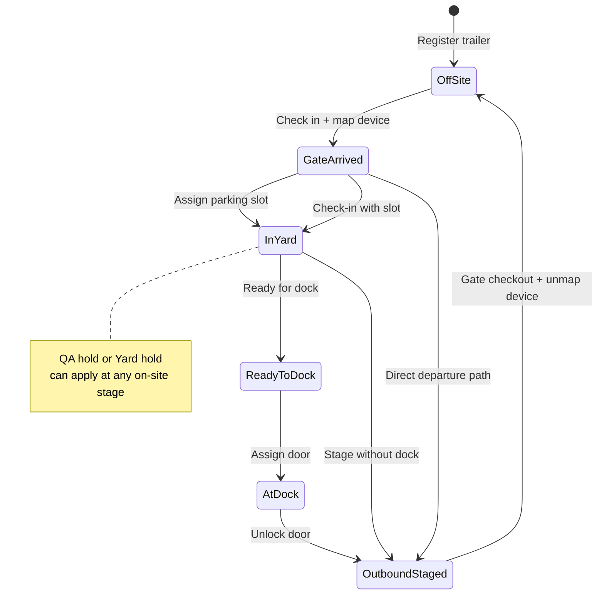

### Status meanings

| Status | What it means |
|--------|----------------|
| **Off site** | In the fleet register; not currently at the facility |
| **Gate arrived** | Checked in and device mapped; may be waiting for a slot |
| **In yard** | Parked in a zone (e.g. A-14, B-07) |
| **Ready to dock** | In queue for an open dock door |
| **At dock** | At a door — loading, unloading, or QA |
| **Outbound staged** | Cleared to leave; ready for gate checkout |
| **QA hold / Yard hold** | Work paused until the issue is cleared |

### Device mapping — when it happens

| When | Action |
|------|--------|
| **Gate check-in** | Device is **mapped** to the trailer (mandatory) |
| **While on site** | Device stays mapped; telemetry feeds Cold Chain and Exceptions |
| **Gate checkout** | Device is **unmapped** and returned to the available pool for the next trailer |

---

## 5. Core workflows

### 5.1 Gate check-in

**Who:** Gate Clerk (sometimes Yard Operations)  
**Where:** **Gates** or **Trailers**

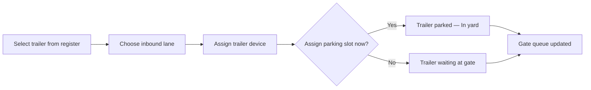

| Step | What you do | What happens |
|------|-------------|--------------|
| 1 | Open **Check in trailer** | List shows trailers that are off site and available |
| 2 | Pick gate lane | Records which lane the trailer used |
| 3 | Assign a trailer device | Links the smart unit on the trailer (required at gate) |
| 4 | Enter seal, temperature if needed | Captures arrival condition |
| 5 | Optionally pick a parking slot | Trailer goes straight to the yard, or waits at gate |
| 6 | Confirm | Trailer appears on Dashboard, Yards map, and gate queue |

---

### 5.2 Assign parking slot

**Who:** Yard Operations, Gate Clerk  
**Where:** **Yards**, **Gates** (awaiting trailers panel), or **Assign parking slot** popup

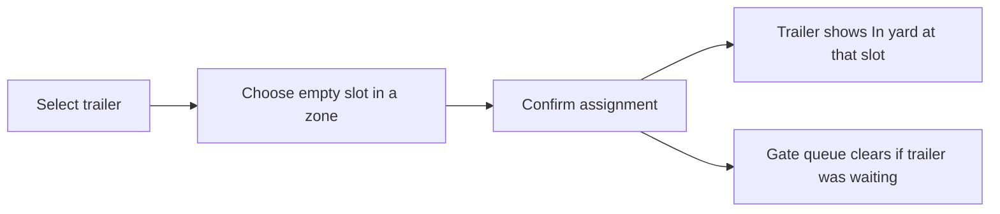

On the **Yards** map you can also use **recommend slot** when BLE proximity suggests the best empty space near the trailer.

---

### 5.3 Dock assignment

**Who:** Yard Operations  
**Where:** **Docks**

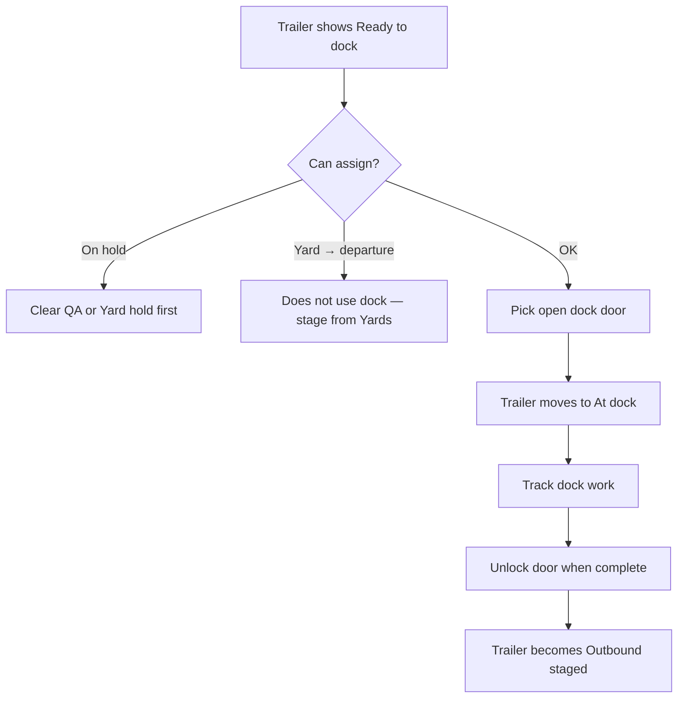

**Dock work stages** (updated as work progresses):

| Stage | Meaning |
|-------|---------|
| At door | Trailer assigned; work not started |
| Loading / Unloading | Active work at the door |
| QA verification | Quality check in progress |
| Ready to unlock | Door can be released |
| Unlock | Trailer leaves the door → **Outbound staged** |

---

### 5.4 Update yard status

**Who:** Yard Operations, QA, Gate  
**Where:** **Trailers** → status icon in the Actions column

Opens one screen to change everything about a trailer’s visit:

| Field | What you set |
|-------|--------------|
| **Yard status** | Where the trailer is in the visit (in yard, ready to dock, at dock, etc.) |
| **Operational hold** | None, QA hold, or Yard hold |
| **Dock workflow** | Dock required, or yard → departure without docking |

Use this when you need to correct status or apply a hold without going through gate or dock screens.

---

### 5.5 Gate exit

**Who:** Gate Clerk  
**Where:** **Gates** → Gate exit

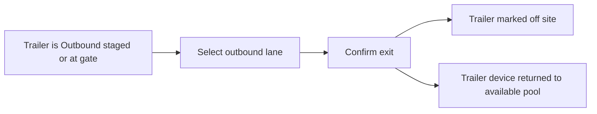

---

## 6. Day-in-the-life by role

### Gate Clerk — inbound and outbound shift

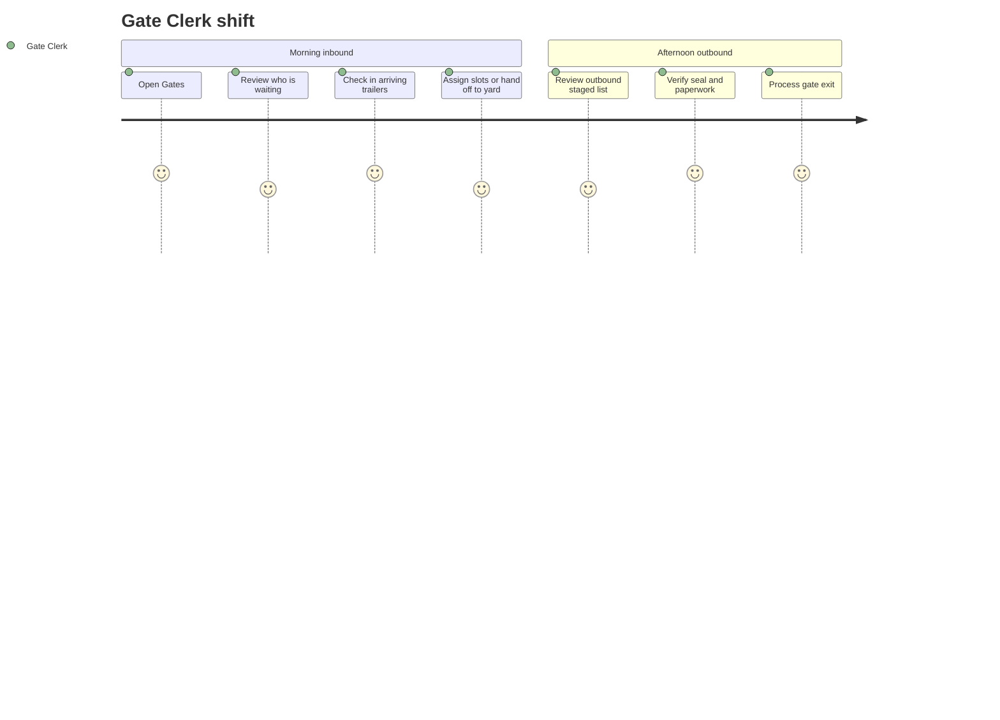

| When | You do | Where |
|------|--------|-------|
| Start of shift | Sign in, open **Gates** | Gates |
| Inbound | Check in trailers, assign devices | Gates / Trailers |
| Waiting trailers | Assign parking or notify yard | Gates / Yards |
| Outbound | Process exits for staged trailers | Gates |
| End of shift | Sign out | Sidebar |

---

### Yard Operations — slots and docks

| When | You do | Where |
|------|--------|-------|
| Start | Review **Dashboard** and **Yards** occupancy | Dashboard, Yards |
| Parking | Assign or move trailers to slots | Yards |
| Dock queue | Review **Ready to dock** list | Docks |
| Docking | Assign doors, advance work stages | Docks |
| Departure | Unlock doors; stage skip-dock trailers from **Yards** | Docks, Yards |
| Audit | Review **Movement** log in header | Movement |

---

### QA Inspector — cold chain and exceptions

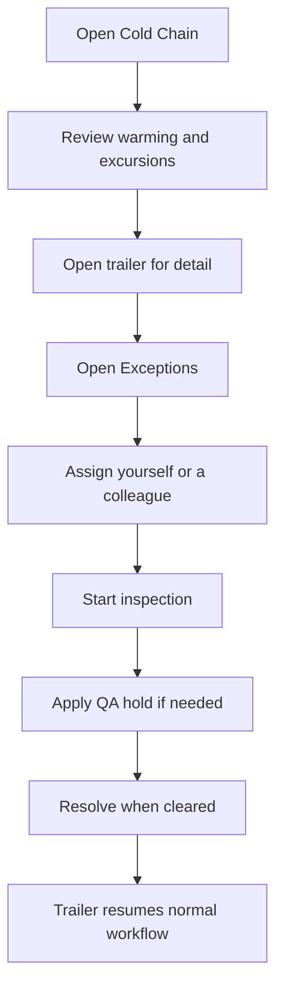

| When | You do | Where |
|------|--------|-------|
| Monitor | Scan temperature status across site | Cold Chain |
| Triage | Work the **Exceptions** list by priority | Exceptions |
| Investigate | Open trailer, review history and device data | Trailer detail |
| Hold | Set QA hold via status update if product is at risk | Trailers |
| Close | Resolve exception when issue is fixed | Exceptions |

**Exceptions appear automatically when the system detects:**

- Temperature excursion or warming trend
- Lost or stale reefer signal
- Active QA or yard hold
- Low fuel on reefer
- Trailer on site too long (long dwell)
- Reefer alarm
- Trailer device connectivity problems

You do not create exceptions manually — you **assign**, **inspect**, and **resolve** them.

---

### Site Lead & Platform Admin — oversight

| When | You do | Where |
|------|--------|-------|
| Morning | Review **Dashboard** KPIs and alerts | Dashboard |
| Operations | Spot-check gate queue, dock utilization, exceptions | Gates, Docks, Exceptions |
| Reporting | Generate and export reports | Reports |
| Analytics | Review trends and carrier performance | Analytics |
| Admin only | Manage user accounts | Users |

---

### Field staff — mobile

Open **Mobile** from the desktop header, or go directly to the mobile view.

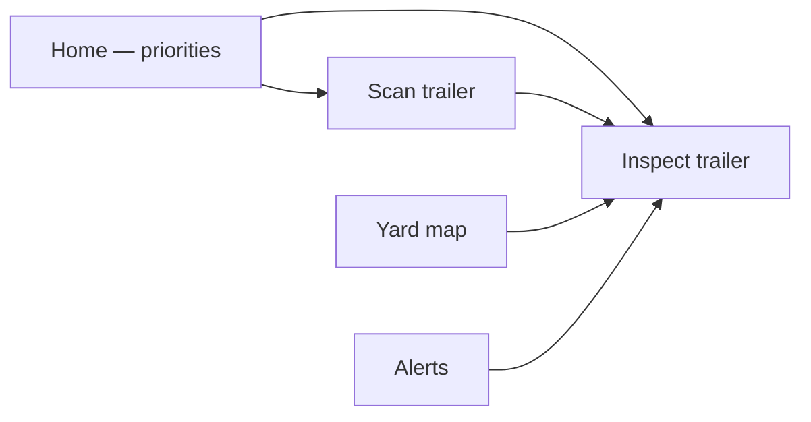

| Screen | What you do |
|--------|-------------|
| **Home** | See today’s priority walk list and quick stats |
| **Scan** | Look up a trailer by number or scan |
| **Yard** | View slots by zone; tap a trailer to inspect |
| **Alerts** | Review cold-chain and smart alerts; jump to inspect |
| **Inspect** | Record temperature, fuel, and seal readings |

Use **Desktop** (top-left on mobile) to return to the main application.

---

## 7. Other areas users work in

### Dashboard
Morning starting point: trailers on site, gate activity, temperature issues, smart alerts, and zone occupancy.

### Trailers
Master list of every trailer in the fleet. Register new trailers, edit details, check in at gate, update status, map devices.

### Trailer devices
Pool of smart units (temperature, fuel, GPS, etc.) that get assigned to trailers at gate check-in. Track which device is on which trailer and whether it is available, in use, or charging.

### Infrastructure
Fixed equipment on the site — gate readers, BLE anchors, gateways, dock sensors. Used for automatic movement detection and slot recommendations. Ops can install assets, mark maintenance, and acknowledge alerts.

### Cold Chain
All refrigerated trailers in one table: actual vs setpoint temperature, fuel, signal status. Filter by excursion, warming, or offline.

### Exceptions
Prioritized work queue with suggested steps (playbooks). Assign an owner, inspect, resolve.

### Movement
Audit trail of everything that happened — gate in/out, slot moves, dock assignments, holds.

### Reports
Pick a report type (yard utilization, cold chain, gate activity, dwell, etc.), choose a date range, generate and export as PDF, Excel, or CSV.

### Analytics & Insights
Trends, KPIs, and suggested focus areas for the site.

### Integrations
View connection status to OTM, carriers, and OEM systems (configuration view).

---

## 8. What the system does automatically

Users focus on decisions; Smart Yard keeps the picture current in the background.

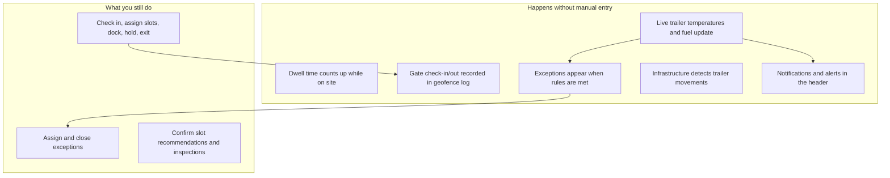

| What you notice | What the system is doing |
|-----------------|--------------------------|
| Temperature and “last updated” change over time | Live reefer telemetry refreshes on site |
| Dwell hours increase while you work | Time on site is calculated from arrival |
| New rows in **Exceptions** | Rules engine flags risk (temp, fuel, dwell, holds, devices) |
| Toast messages and bell notifications | Operations feed surfaces recent activity |
| **Movement** log grows | Each check-in, slot change, and dock action is recorded |
| Slot suggestion on **Yards** map | BLE anchors estimate best nearby empty slot |
| Infrastructure **movements** tab updates | Fixed readers detect trailer passing anchor points |

You do **not** need to refresh the page for dwell and temperature to advance — the yard picture stays live while you work.

---

## 9. Complete visit — example story

**Trailer BH-3381** arrives inbound with chilled product.

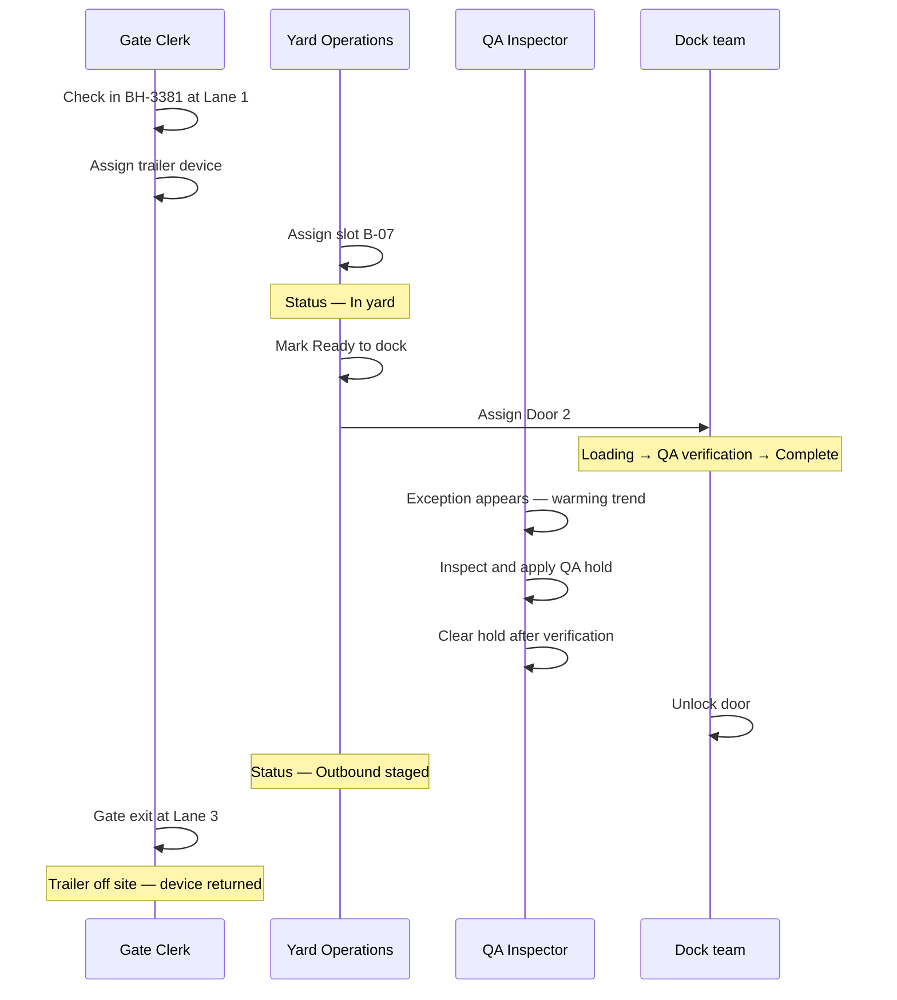

| Step | Who | Action |
|------|-----|--------|
| 1 | Gate Clerk | Check in trailer, assign device |
| 2 | Yard Ops | Assign parking slot B-07 |
| 3 | Yard Ops | Set **Ready to dock** |
| 4 | Yard Ops | Assign **Door 2** |
| 5 | Dock team | Progress through loading and QA stages |
| 6 | QA Inspector | Respond to temperature exception, hold, then release |
| 7 | Yard Ops | Unlock door → **Outbound staged** |
| 8 | Gate Clerk | Process gate exit |

---

## 10. Quick reference — where to go

| I need to… | Go to |
|------------|-------|
| See the big picture | **Dashboard** |
| Check a trailer in or out | **Gates** |
| Assign or find a parking slot | **Yards** |
| Assign a dock door | **Docks** |
| Find any trailer | **Trailers** |
| Change status or apply a hold | **Trailers** → Update status |
| Check temperatures | **Cold Chain** |
| Work priority issues | **Exceptions** |
| See what happened today | **Movement** (header) |
| Manage smart units on trailers | **Trailer devices** |
| Manage fixed site equipment | **Infrastructure** |
| Export a report | **Reports** |
| Walk the yard with a phone | **Mobile** (header link) |
| Manage users | **Users** (admin only) |

---

*Boar’s Head Smart Yard — user flows and automation from an operations perspective.*
