# Boar’s Head Smart Yard — End-to-End User Flows & Automation

This document describes how users move through the **yard-temp-mock** application, how operational workflows connect Gate → Yard → Dock → Exit, and how background automation makes the demo behave like a live site.

**Live demo URL (GitHub Pages):** `https://busoft-stm.github.io/boars-yard-system/`  
**Default password:** `yard-demo`

---

## 1. System overview

Smart Yard is a React + Vite mock that simulates a distribution-center yard:

| Layer | What it does |
|-------|----------------|
| **Desktop app** | Command center, yards map, gate, dock, trailers, cold chain, exceptions, devices, infrastructure, reports |
| **Mobile app** | Field workflows: scan, inspect, alerts, yard map (`/mobile`) |
| **IndexedDB (Dexie)** | Persists trailers, movements, gate events, users, layout — survives refresh |
| **Live automation** | Telemetry ticks, dwell updates, demo toasts, derived exceptions, geofence events |

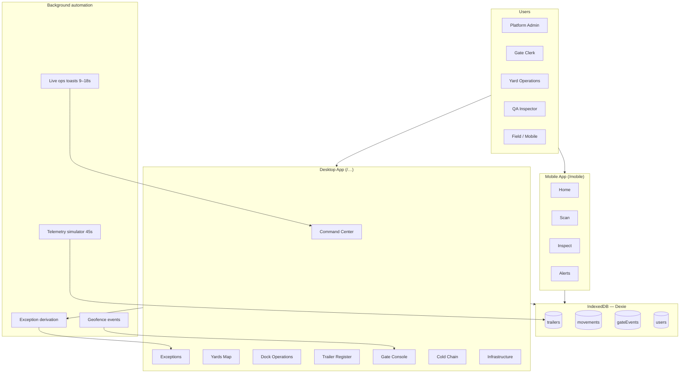

---

## 2. Roles & access

| Role | Demo user | Primary focus | Mobile |
|------|-----------|---------------|--------|
| **Platform Admin** | alex.rivera@boarshead.com | Users, all modules | ✓ |
| **Site Lead** | morgan.chen@boarshead.com | Oversight, analytics, escalation | ✓ |
| **Yard Operations** | jordan.hale@boarshead.com | Slots, movements, dock queue | ✓ |
| **QA Inspector** | sam.okonkwo@boarshead.com | Cold chain, holds, exceptions | ✓ |
| **Gate Clerk** | casey.brooks@boarshead.com | Check-in, seal, gate exit | ✓ |
| **Viewer** | riley.nguyen@boarshead.com | Read-only dashboards | — |

Access is enforced by `roleCanAccess()` in `src/data/users.ts`. Blocked routes redirect to `/`.

---

## 3. Authentication flow

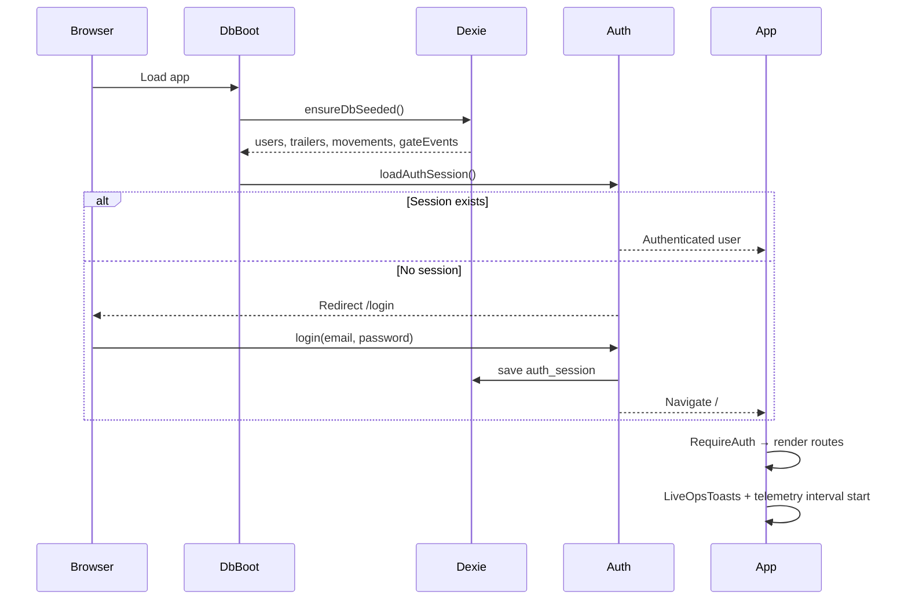

**Steps**
1. App boots → `DbBoot` seeds/opens IndexedDB.
2. `AuthProvider` restores session from `meta.auth_session`.
3. Unauthenticated users see **Sign in** (`/login`).
4. Active users only (`status: active`); password default `yard-demo`.
5. **Logout** clears session and returns to login.

**Figma capture mode:** URL hash `#figmacapture=` auto-signs in as admin (for design export scripts only).

---

## 4. Trailer lifecycle (core E2E flow)

Every on-site trailer follows a visit lifecycle. Holds and dock workflow are overlays.

### 4.0 Main flowchart — lifecycle and automation

See **[TRAILER_LIFECYCLE_FLOWCHART.md](./TRAILER_LIFECYCLE_FLOWCHART.md)** for the full Mermaid diagram and automation rules.

**Implementation note:** slot assignment is assisted, not fully autonomous. GPS and BLE produce the recommendation; the operator confirms it before `assignParkingSlot` and `applyBleProximitySlot` persist the result.

### 4.0 Architecture view — register to checkout

Layered system diagram: fleet register → gate + device edge → yard/dock ops → platform persistence → gate exit.

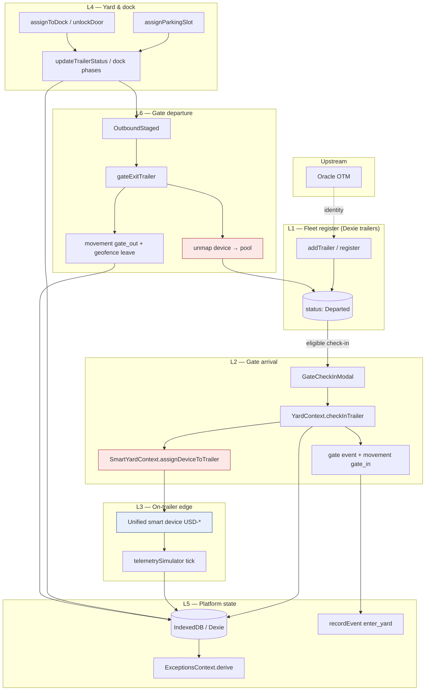

| Phase | Route / module | Key API | Persistence |
|-------|----------------|---------|-------------|
| Register | `/trailers` | `addTrailer` | `trailers` table, `Departed` |
| Check-in + map | `/gate`, `/trailers` | `checkInTrailer`, `assignDeviceToTrailer` | trailer, gate event, movement, device |
| Park / dock | `/yards`, `/dock` | `assignParkingSlot`, `assignToDock` | trailer zone/slot/dock, movements |
| Telemetry | background | `runTelemetryTick` | temp, fuel, dwell, history |
| Checkout | `/gate` | `gateExitTrailer`, device release | `Departed`, gate event, unmapped device |

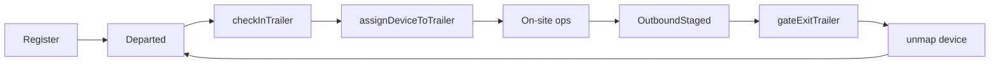

### 4.0.1 Status state machine

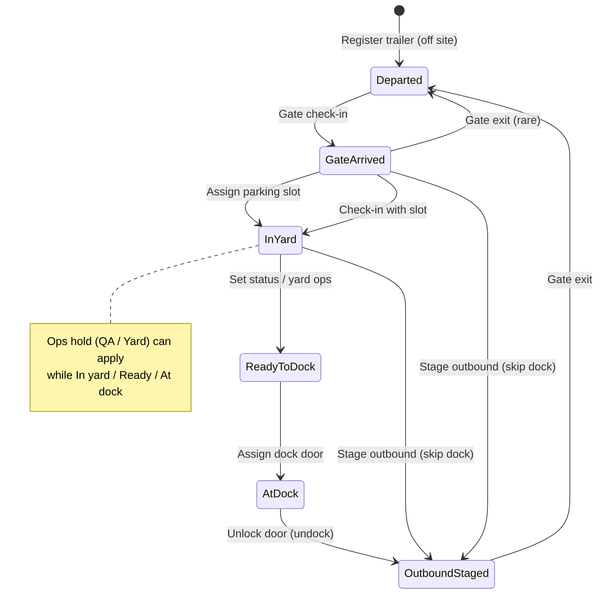

### 4.1 Gate check-in

**Who:** Gate Clerk, Yard Ops  
**Where:** `/gate` → Check in trailer, or `/trailers` → Check in at gate

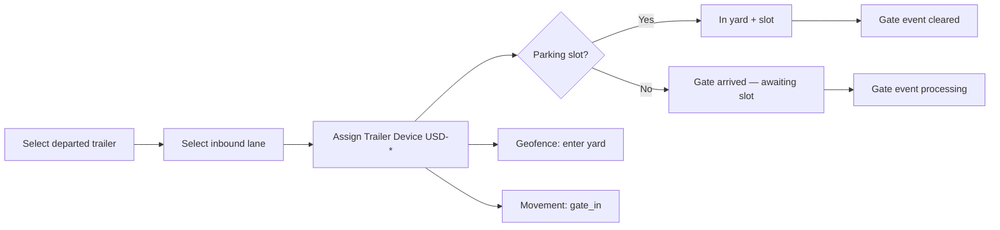

| Step | System action | Persistence |
|------|---------------|-------------|
| Pick trailer | Must be `Departed`, `recordStatus: active` | — |
| Pick lane | Inbound-capable, active lane | — |
| Assign device | Required at gate; validates health | SmartYard (session) |
| Optional slot | Immediate `In yard` vs `Gate arrived` | Dexie trailer + movement + gate event |
| Geofence | `recordEvent(enter_yard)` | In-memory |

**Modal:** `GateCheckInModal.tsx`  
**API:** `YardContext.checkInTrailer()`

---

### 4.2 Yard parking assignment

**Who:** Yard Operations, Gate Clerk  
**Where:** `/yards`, `/gate` (awaiting panel), Assign slot modal

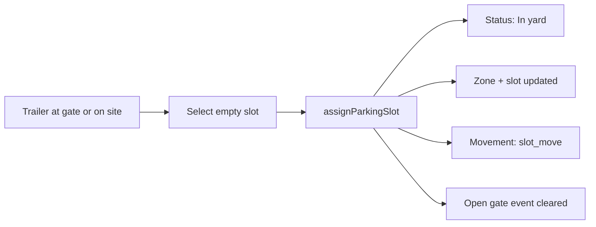

**Optional automation:** BLE proximity recommend on Yards map (`applyBleProximitySlot`) suggests a slot from infrastructure anchors + trailer device BLE.

---

### 4.3 Dock assignment

**Who:** Yard Operations, Gate Clerk  
**Where:** `/dock`

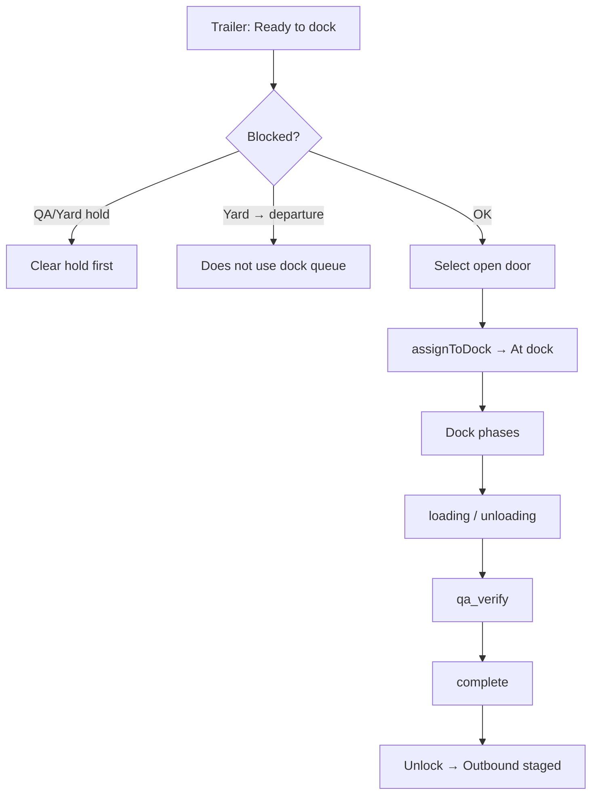

| Dock phase | Meaning |
|------------|---------|
| idle | At door |
| loading / unloading | Active work |
| qa_verify | QA verification |
| complete | Ready to unlock |

**Skip-dock trailers** (`dockRequired: false`) stage for departure from Yards without entering the dock queue.

---

### 4.4 Update yard status

**Who:** Yard Operations, QA, Gate  
**Where:** `/trailers` → Actions column → **Update yard status** icon (`swap_horiz`)

Single modal updates three related fields together:

| Field | Purpose |
|-------|---------|
| Yard status | Lifecycle: Gate arrived → In yard → Ready to dock → At dock → Outbound staged |
| Operational hold | None / QA hold / Yard hold |
| Dock workflow | Dock required vs Yard → departure |

**Component:** `UpdateTrailerStatusModal.tsx`

---

### 4.5 Gate exit

**Who:** Gate Clerk  
**Where:** `/gate` → Gate exit

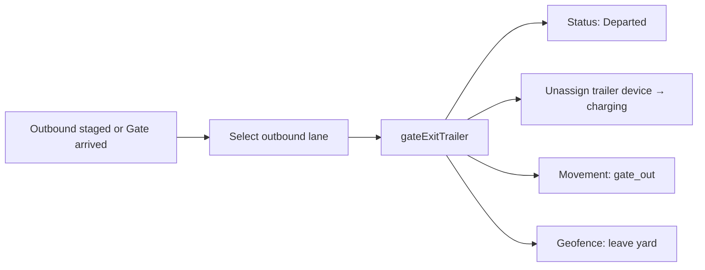

---

## 5. Role-based user journeys

### 5.1 Gate Clerk — morning inbound

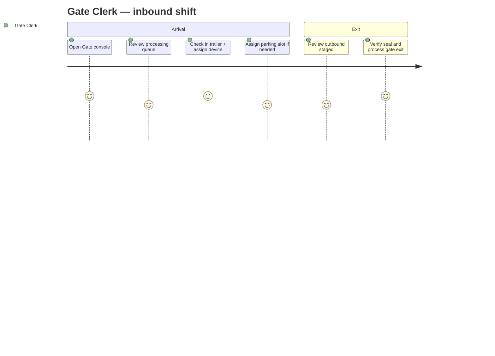

| # | Action | Page | Result |
|---|--------|------|--------|
| 1 | Sign in | `/login` | Session saved |
| 2 | Open gate queue | `/gate` | See processing / held events |
| 3 | Check in trailer | Gate modal | Trailer on site, device mapped |
| 4 | Assign slot | Assign modal / Gate panel | Trailer parked in zone |
| 5 | Gate exit | Gate exit modal | Trailer departed, device returned to pool |

---

### 5.2 Yard Operations — dock & slot management

| # | Action | Page | Result |
|---|--------|------|--------|
| 1 | Review yard map | `/yards` | Occupancy by zone |
| 2 | Move trailer / stage outbound | Yards inspector | Status updated |
| 3 | Review ready queue | `/dock` | Trailers waiting for doors |
| 4 | Assign door | `/dock` | Trailer at dock |
| 5 | Advance dock phases | Dock inspector | Work tracked |
| 6 | Unlock door | `/dock` | Outbound staged |

---

### 5.3 QA Inspector — cold chain & exceptions

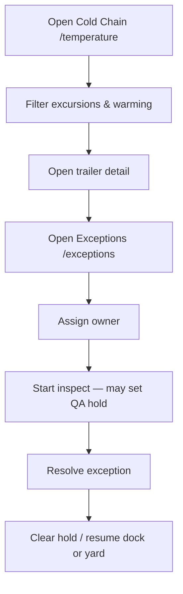

| Trigger | Auto-derived exception | Playbook |
|---------|------------------------|----------|
| Temp critical / warn | Temperature excursion | `temperature` |
| Telemetry offline | Stale / no signal | `device_offline` |
| QA or Yard hold | Hold active | `hold` |
| Fuel &lt; 25% | Low fuel | `fuel` |
| Dwell ≥ 16h | Long dwell | `dwell` |
| Reefer alarm | Reefer fault | `reefer` |

**Source:** `ExceptionsContext` derives rows from live trailer + device state on every refresh.

---

### 5.4 Platform Admin — users & oversight

| # | Action | Page |
|---|--------|------|
| 1 | Manage users | `/users` |
| 2 | Review command center | `/` |
| 3 | Run reports | `/reports` |
| 4 | Review integrations | `/integrations` |

---

### 5.5 Mobile field user

**Route base:** `/mobile` (GitHub Pages: `/boars-yard-system/mobile`)

```mermaid
flowchart LR
  subgraph Tabs
    Home[/mobile]
    Map[/mobile/map]
    Scan[/mobile/scan]
    Alerts[/mobile/alerts]
    Inspect[/mobile/inspect]
  end

  Scan --> Inspect
  Map --> Inspect
  Alerts --> Inspect
  Home --> Scan
  Home --> Inspect
```

| Screen | Purpose |
|--------|---------|
| **Home** | Priority walk list, queue stats, quick links |
| **Scan** | Lookup trailer by number → inspect |
| **Yard** | Zone slot grid colored by temp status |
| **Alerts** | Smart alerts + cold-chain queue |
| **Inspect** | Capture temp / fuel / seal (demo: queued for sync UI) |

Mobile opens from desktop header **Mobile** link (new tab). **Desktop** button on mobile returns to main app.

---

## 6. Supporting modules

### 6.1 Trailer register

**`/trailers`** — master fleet list: register, edit, disable, check-in entry, status modal, device mapping.

### 6.2 Trailer devices (USD-*)

**`/devices`** — rechargeable units on trailers: install, assign, lifecycle, capabilities (temp, fuel, GPS, BLE, RFID).

> Separate from **Infrastructure** (fixed site assets).

### 6.3 Infrastructure (fixed site)

**`/infrastructure`** — RFID readers, BLE anchors, gateways, dock sensors, GPS coverage.

| Tab | Purpose |
|-----|---------|
| Device inventory | CRUD, health, maintenance |
| Infrastructure map | Site layout |
| Trailer movements | Auto-detected infra movements |
| Infrastructure alerts | Acknowledge / resolve |

Infrastructure enables **BLE slot recommend** on the Yards map and feeds exception device-health checks.

### 6.4 Reports

**`/reports`** — templates: yard utilization, cold chain, gate activity, dwell, carrier performance, device telemetry, infrastructure ops, exception summary.

Export: CSV, Excel, PDF (client-side). Period: today, 7d, 30d, custom.

### 6.5 Analytics & insights

- **`/analytics`** — aggregate KPIs and charts  
- **`/insights`** — AI-style recommendations from live yard state  

---

## 7. Automation in this project

Automation makes the mock feel **live** without a real backend.

### 7.1 Automation architecture

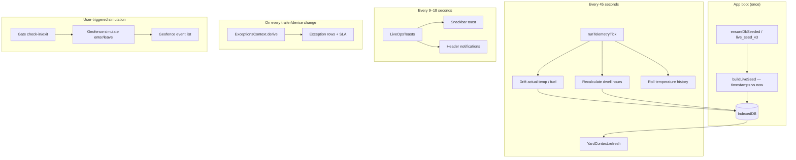

### 7.2 Dexie live seed (`src/db/liveSeed.ts`)

| What | How |
|------|-----|
| **When** | On first load; migration `live_seed_v3` refreshes yard sample data |
| **Trailers** | `arrivedAtMs`, `lastTelemetryAtMs` set relative to current clock |
| **Dwell** | Computed from arrival time — increases in real time |
| **Movements / gate events** | Timestamps hydrated to “today”; sorted by recency |
| **Cleanup** | Ghost gate references removed; gate history aligned to real trailers |

**Preserved across reseed:** users, auth session, yard layout, legacy platform devices.

### 7.3 Telemetry simulator (`src/db/telemetrySimulator.ts`)

| Profile | Behavior |
|---------|----------|
| **critical** | Temperature drifts upward (excursion scenario) |
| **warn** | Slow warming toward threshold |
| **ok** | Small noise around setpoint |
| **frozen** | Near 0°F setpoint |
| **offline** | Stale telemetry; no live reads |

Also: fuel slowly decreases, `lastUpdate` shows relative time (“3 min ago”), sparkline history rolls forward.

**Interval:** 45 seconds (`TELEMETRY_TICK_MS`)

### 7.4 Live ops toasts (`src/components/LiveOpsToasts.tsx`)

Cosmetic **operations feed** for demo atmosphere:

- Random messages: check-in, slot assign, movement, exception, reefer alert
- Uses real trailer numbers from current yard state
- Mirrors into header notification bell
- Does **not** write fake movements to Dexie (display only)

**Interval:** first toast 4–7s, then every 9–18s

### 7.5 Exception derivation (`src/exceptions/ExceptionsContext.tsx`)

Fully **automatic** — no manual exception creation:

1. Read all on-site trailers from Dexie  
2. Join trailer device from SmartYard  
3. Evaluate rules (temp, hold, fuel, dwell, reefer, device connectivity)  
4. Produce exception rows with playbooks and SLA timers  

User actions: **assign**, **inspect**, **resolve** (stored in session state).

### 7.6 Geofence simulation (`src/geofence/GeofenceContext.tsx`)

| Event | When |
|-------|------|
| `enter_yard` | Gate check-in |
| `leave_yard` | Gate exit |
| Manual simulate | Gate / Yards pages (demo buttons) |

Triggers header notifications and recovery prompts on Command Center / Gate.

### 7.7 Infrastructure automation (demo)

| Feature | Behavior |
|---------|----------|
| Infra movements | Seed + session mutations in SmartYard |
| Infra alerts | Acknowledge / resolve in UI |
| BLE recommend | Anchor proximity → suggested slot on Yards map |

### 7.8 Figma export automation (dev/presales tooling)

Not runtime user automation — used to capture screens into Figma:

| Script | Purpose |
|--------|---------|
| `scripts/figma-capture-batch.sh` | Opens routes with `#figmacapture=` for MCP capture |
| `scripts/figma-capture-routes.json` | Route manifest |
| `scripts/figma-wire-prototype.js` | Wires Figma prototype navigation |

---

## 8. Data persistence model

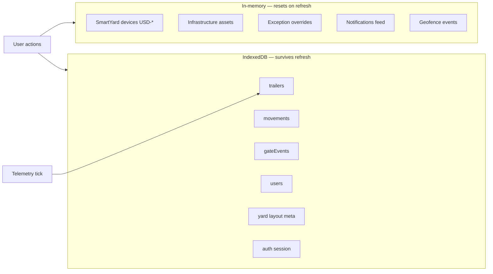

| User action | Persisted? |
|-------------|------------|
| Check-in, slot assign, dock, status change, gate exit | ✓ Dexie |
| Assign trailer device | Session only |
| Install infra asset | Session only |
| Resolve exception | Session only |
| Mobile inspect save | UI only (“queued for sync”) |

---

## 9. Route map (quick reference)

### Desktop

| Route | Page |
|-------|------|
| `/` | Command Center |
| `/yards` | Yards map & zones |
| `/trailers` | Trailer register |
| `/trailer/:id` | Trailer detail |
| `/gate` | Gate console |
| `/dock` | Dock operations |
| `/temperature` | Cold chain |
| `/exceptions` | Exceptions & playbooks |
| `/movements` | Movement audit log |
| `/devices` | Trailer devices |
| `/infrastructure` | Fixed site infrastructure |
| `/reports` | Report library |
| `/analytics` | Analytics |
| `/insights` | Insights |
| `/users` | User admin |
| `/login` | Sign in |

### Mobile

| Route | Screen |
|-------|--------|
| `/mobile` | Home |
| `/mobile/map` | Yard map |
| `/mobile/scan` | Scan / lookup |
| `/mobile/alerts` | Alerts |
| `/mobile/inspect` | Inspect trailer |

Legacy redirects: `/map` → `/yards`, `/m/*` → `/mobile`

---

## 10. Deployment & SPA routing

**Build:** `npm run build:pages` → output in `docs/`  
**Base path:** `/boars-yard-system/` (GitHub Pages project site)

| Concern | Solution |
|---------|----------|
| Asset 404s | Vite `base: '/boars-yard-system/'` |
| Deep link refresh 404 | `404.html` copy of `index.html` |
| Router basename | `BrowserRouter basename={import.meta.env.BASE_URL}` |
| Logo / mobile links | Use `import.meta.env.BASE_URL` for absolute paths |

---

## 11. End-to-end scenario — complete visit

**Scenario:** Carrier trailer checks in, parks, loads at dock, QA hold, release, exits.

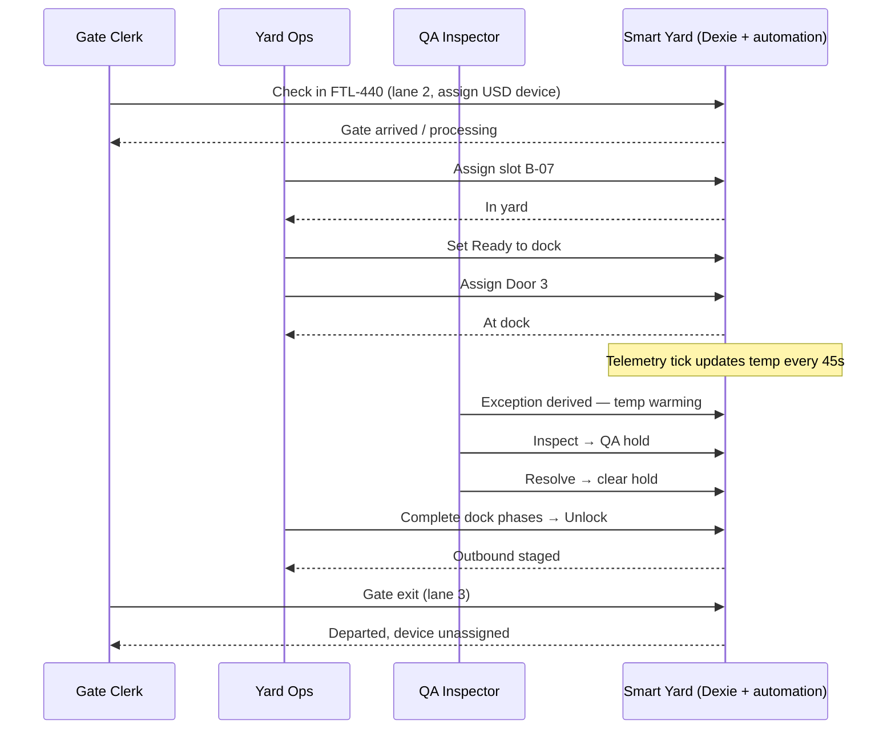

---

## 12. Related documentation

| File | Topic |
|------|-------|
| `Gates_Yards_Docks.txt` | Gate, yard, dock workflows |
| `Yard_Infrastructure.txt` | Fixed infrastructure assets |
| `Trailer_Devices.txt` | USD trailer device pool |
| `src/data/users.ts` | Roles and nav permissions |
| `src/db/liveSeed.ts` | Live sample data hydration |
| `src/db/telemetrySimulator.ts` | Background telemetry |

---

*Document version: aligned with yard-temp-mock as of live seed v3, `/yards` route, `/mobile` route, and GitHub Pages deployment.*
